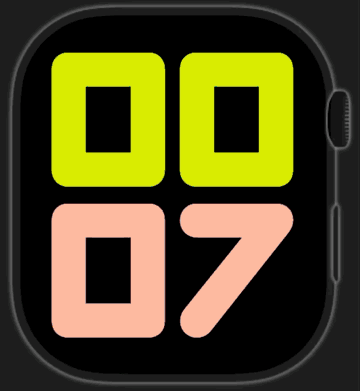

# Codex Watch

Aplicación experimental para seleccionar una tarea reciente de Codex desde el Apple Watch, consultar sus últimos mensajes, grabar una orden de voz y enviarla al Codex que se ejecuta en el Mac.

## See it in action

Full one-minute walkthrough · plays directly in the README.

## Componentes

- `CodexWatch`: app compañera para iPhone y enlace con WatchConnectivity.
- `CodexWatch Watch App`: selector cronológico, lectura de mensajes, dictado o grabación y envío de órdenes.
- `CodexWatchBridge`: puente local autenticado que habla con `codex app-server`.

El puente detecta ZeroTier y vincula el listener exclusivamente a esa IPv4 y su CIDR. Exige el token de acceso mostrado por la aplicación de macOS y no publica Bonjour.

El icono de la barra de menús representa la conexión extremo a extremo: verde únicamente después de una respuesta autenticada reciente al Companion del iPhone, naranja cuando Codex y el puente están preparados pero no hay contacto reciente con el iPhone, y rojo si falla cualquiera de los servicios locales. El contacto verde caduca tras 45 segundos sin una nueva respuesta satisfactoria. El reloj conserva localmente los últimos mensajes de las conversaciones consultadas y los muestra inmediatamente al abrir una tarea. El puente lee de forma acotada el final del historial local, por lo que una conversación grande no obliga a reconstruirla completa. Solo vuelve a solicitar una conversación cuando la marca `updatedAt` de la lista anuncia información nueva; la actualización ocurre en segundo plano sin ocultar los mensajes ni alterar la posición de lectura.

La lista del Watch pide una copia fresca al abrirse y cada 10 segundos mientras permanece visible. La petición de WatchConnectivity despierta a la app compañera del iPhone, que consulta el bridge y responde directamente al reloj; además, el iPhone actualiza su copia cada 15 segundos mientras la app puede ejecutarse. Cada cambio se envía también como instantánea persistente, versionada y deduplicada: el reloj recibe la lista más nueva aunque el mensaje inmediato falle y descarta entregas antiguas. El iPhone conserva la última lista válida para no borrar el reloj con una caché vacía al reactivarse en segundo plano.

El icono `+` de la esquina superior de la lista permite crear una tarea nueva. El reloj propone el proyecto de la tarea más reciente, permite elegir otro proyecto o ninguno, recoge la petición mediante dictado y envía al bridge un `thread/start` seguido del primer `turn/start`.

## Órdenes de voz

La app compañera ofrece dos rutas:

- **Dictado del Apple Watch:** el sistema del reloj convierte la voz en texto y la app envía ese texto a Codex. No usa la API de OpenAI.
- **OpenAI API:** el reloj graba una nota AAC/M4A y la transfiere sin transcribir al iPhone y al Mac. El bridge la envía al endpoint de transcripción de OpenAI y entrega el texto resultante a la tarea seleccionada. Esta opción genera facturación de API.

El Companion permite seleccionar cualquiera de los seis modelos de transcripción de ficheros admitidos: `gpt-transcribe`, `gpt-4o-transcribe`, `gpt-4o-mini-transcribe`, `gpt-4o-mini-transcribe-2025-12-15`, `gpt-4o-transcribe-diarize` y `whisper-1`. La API key se configura en Codex Watch Bridge y se guarda únicamente en el llavero del Mac.

Si Codex Desktop ya es propietario de la tarea seleccionada, el bridge entrega la orden al proceso propietario mediante el canal IPC local y privado de Codex. Si la tarea todavía no está activa en Desktop, el bridge la abre por su enlace `codex://`, espera brevemente a que registre su propietario y entrega entonces la orden con un identificador idempotente. El Watch solo muestra éxito cuando Codex acepta el turno y muestra un error final, en vez de una espera indefinida, si Desktop no logra activarlo.

## Fuera de casa

Configura en la app del iPhone el método de conexión, la IP o nombre del Mac, el puerto y el token copiado desde el bridge. La dirección queda guardada únicamente en el dispositivo y no forma parte del código fuente. El token aleatorio de 256 bits se guarda en Keychain tanto en macOS como en iOS. WatchConnectivity mantiene el Apple Watch desacoplado de este detalle: el reloj habla con el iPhone y el iPhone reenvía la petición al Mac.

Para usarlo fuera de casa, la configuración activa del bridge usa la IP privada de ZeroTier detectada en el Mac. El cliente admite configurar otros destinos privados, pero requieren que el servicio correspondiente se vincule explícitamente a esa interfaz; no se abre automáticamente en Wi-Fi/LAN. Un dominio o una IP pública exige HTTPS y un proxy seguro. El puerto HTTP `48720` del bridge no debe publicarse directamente en Internet.

## Controles de seguridad

- Listener vinculado a la IPv4 que comunica `zerotier-cli`, más allowlist de su CIDR y loopback; cualquier origen ajeno se cancela antes de leer datos.
- Token de 256 bits generado con `SecRandomCopyBytes`, almacenado en Keychain y comparado en tiempo constante.
- Bloqueo temporal tras cinco intentos de autenticación fallidos por origen.
- Máximo de 24 conexiones simultáneas y tiempo máximo de 90 segundos por conexión.
- Cabeceras limitadas a 16 KiB y cuerpo limitado a 2 MiB para admitir audio; no se admite `Transfer-Encoding`.
- Mensajes de error HTTP genéricos: los detalles internos solo se registran localmente.
- `/health` requiere la misma autenticación que el resto de endpoints.

La superficie y las limitaciones conocidas se documentan en [SECURITY.md](SECURITY.md).

## Puente del Mac

La compilación activa puede instalarse en `~/Applications/CodexWatchBridge.app`. Un LaunchAgent local puede iniciarla al abrir sesión. El icono rojo indica que Codex o el servidor privado no están listos, el naranja que el Mac está preparado pero todavía no ha respondido recientemente al Companion, y el verde confirma una respuesta autenticada reciente al iPhone. El endpoint `/health` solo acepta orígenes de red privada y requiere el token.

## Seguridad de conversaciones

Listar tareas y abrir mensajes son operaciones estrictamente de solo lectura y nunca reanudan un hilo. Solo una acción explícita de enviar o crear puede escribir. Los comandos se deduplican por UUID, se serializan por hilo y dejan de reintentarse temporalmente después de tres fallos. Las escrituras a tareas existentes se entregan al propietario activo de Codex Desktop mediante una conexión efímera; el puente no adquiere propiedad persistente del hilo. Véase [el informe del incidente del 15-08-2026](docs/INCIDENT-2026-08-15.md).
