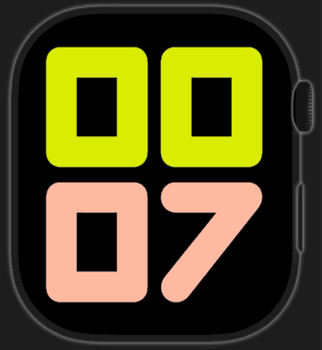

# Codex Watch

[English](README.md) · **Español**

Aplicación experimental para seleccionar una tarea reciente de Codex desde el Apple Watch, consultar sus últimos mensajes, grabar una orden de voz y enviarla al Codex que se ejecuta en el Mac.

## Versión estable actual

**Codex Watch v0.8.1 · build 45** hace autosuficiente la ruta independiente del
Watch y resistente a fallos temporales de conectividad. Se empareja directamente
con el Mac mediante un encuentro efímero en el
llavero de iCloud cifrado de extremo a extremo y un código de seis cifras, sin
necesitar el Companion del iPhone. El método de voz y el modelo de transcripción
se pueden elegir tanto en el reloj como en el Mac y se sincronizan por el buzón
cifrado. La ruta iPhone/ZeroTier permanece como respaldo. Las órdenes de texto
que aún no hayan alcanzado HTTPS quedan visiblemente en cola en el Watch y se
reintentan tras reconectar con su UUID original; una orden ya aceptada no vuelve
a subirse. Consulta
[CHANGELOG.md](CHANGELOG.md).

## Verlo en acción

Recorrido completo de un minuto · se reproduce directamente en el README.

## Componentes

- `CodexWatch`: app compañera para iPhone y enlace con WatchConnectivity.
- `CodexWatch Watch App`: selector cronológico, lectura de mensajes, dictado o grabación y envío de órdenes.
- `CodexWatch Standalone`: compilación solo para Watch con transporte HTTPS
  directo y sin dependencia del iPhone durante el uso.
- `CodexWatchBridge`: puente local autenticado que consume el `CodexController`
  loopback de Relay y no posee un proceso App Server ni un writer propio.

El puente detecta ZeroTier y vincula el listener exclusivamente a esa IPv4 y su CIDR. Exige el token de acceso mostrado por la aplicación de macOS y no publica Bonjour.

El icono de la barra de menús representa la conexión extremo a extremo: verde únicamente después de una respuesta autenticada reciente al Companion del iPhone, naranja cuando Codex y el puente están preparados pero no hay contacto reciente con el iPhone, y rojo si falla cualquiera de los servicios locales. El contacto verde caduca tras 45 segundos sin una nueva respuesta satisfactoria. El reloj conserva localmente los últimos mensajes de las conversaciones consultadas y los muestra inmediatamente al abrir una tarea. El puente lee de forma acotada el final del historial local, por lo que una conversación grande no obliga a reconstruirla completa. Solo vuelve a solicitar una conversación cuando la marca `updatedAt` de la lista anuncia información nueva; la actualización ocurre en segundo plano sin ocultar los mensajes ni alterar la posición de lectura.

La lista del Watch pide una copia fresca al abrirse y cada 10 segundos mientras permanece visible. La petición de WatchConnectivity despierta a la app compañera del iPhone, que consulta el bridge y responde directamente al reloj; además, el iPhone actualiza su copia cada 15 segundos mientras la app puede ejecutarse. Cada cambio se envía también como instantánea persistente, versionada y deduplicada: el reloj recibe la lista más nueva aunque el mensaje inmediato falle y descarta entregas antiguas. El iPhone conserva la última lista válida para no borrar el reloj con una caché vacía al reactivarse en segundo plano.

El icono `+` de la esquina superior de la lista permite crear una tarea nueva. El selector replica el catálogo local canónico y los nombres visibles de Codex Desktop, incluidos los proyectos sin tareas recientes, con una sola fila por identidad de proyecto y no por carpeta. El reloj permite elegir un proyecto o ninguno, recoge la petición mediante dictado y envía al Controller de Relay una única operación de dominio idempotente usando el ID estable del proyecto.

## Órdenes de voz

El Watch y el Bridge del Mac ofrecen dos rutas seleccionables:

- **Dictado del Apple Watch:** el sistema del reloj convierte la voz en texto y la app envía ese texto a Codex. No usa la API de OpenAI.
- **OpenAI API:** el reloj graba una nota AAC/M4A y la transfiere sin transcribir directamente al Mac mediante el buzón cifrado. El bridge la envía al endpoint de transcripción de OpenAI y entrega el texto resultante a la tarea seleccionada. Esta opción genera facturación de API.

El Watch y el Bridge del Mac permiten seleccionar cualquiera de los seis modelos de transcripción de ficheros admitidos: `gpt-transcribe`, `gpt-4o-transcribe`, `gpt-4o-mini-transcribe`, `gpt-4o-mini-transcribe-2025-12-15`, `gpt-4o-transcribe-diarize` y `whisper-1`. La preferencia solo se sincroniza dentro del canal E2E aprobado. La API key se configura en Codex Watch Bridge y se guarda únicamente en el llavero del Mac.

El bridge entrega toda escritura al Controller loopback de Relay con un identificador idempotente. Relay se ocupa del orden por thread, del lifecycle de App Server, de la interrupción acotada y de la terminación. El Watch solo muestra éxito cuando Relay confirma el `turn/completed` final.

## Fuera de casa

Configura en la app del iPhone el método de conexión, la IP o nombre del Mac, el puerto y el token copiado desde el bridge. La dirección queda guardada únicamente en el dispositivo y no forma parte del código fuente. El token aleatorio de 256 bits se guarda en Keychain tanto en macOS como en iOS. WatchConnectivity mantiene el Apple Watch desacoplado de este detalle: el reloj habla con el iPhone y el iPhone reenvía la petición al Mac.

Para usarlo fuera de casa, la configuración activa del bridge usa la IP privada de ZeroTier detectada en el Mac. El cliente admite configurar otros destinos privados, pero requieren que el servicio correspondiente se vincule explícitamente a esa interfaz; no se abre automáticamente en Wi-Fi/LAN. Un dominio o una IP pública exige HTTPS y un proxy seguro. El puerto HTTP `48720` del bridge no debe publicarse directamente en Internet.

### Transporte independiente del Watch

La build 0.8/44 añade emparejamiento inicial autónomo a la ruta independiente
mediante un buzón HTTPS ciego y cifrado de extremo a extremo. El Watch y el Mac
se descubren a través de una oferta de 15 minutos en el llavero de iCloud y
exigen el mismo código de seis cifras; el transporte normal mantiene conexiones
solo salientes, conserva el UUID y termina en el Controller loopback de Relay.
La ruta del iPhone permanece como respaldo. El protocolo, la frontera de
seguridad, la validación real y el rollback están
documentados en [Transporte independiente del Watch](docs/HTTPS-MAILBOX-TRANSPORT.md).

## Controles de seguridad

- Listener vinculado a la IPv4 que comunica `zerotier-cli`, más allowlist de su CIDR y loopback; cualquier origen ajeno se cancela antes de leer datos.
- Token de 256 bits generado con `SecRandomCopyBytes`, almacenado en Keychain y comparado en tiempo constante.
- Bloqueo temporal tras cinco intentos de autenticación fallidos por origen.
- Máximo de 24 conexiones simultáneas y tiempo máximo de 90 segundos por conexión.
- Cabeceras limitadas a 16 KiB y cuerpo limitado a 2 MiB para admitir audio; no se admite `Transfer-Encoding`.
- Mensajes de error HTTP genéricos: los detalles internos solo se registran localmente.
- `/health` requiere la misma autenticación que el resto de endpoints.

La superficie y las limitaciones conocidas se documentan en [SECURITY.md](SECURITY.md).

## Puente del Mac

La compilación activa puede instalarse en `~/Applications/CodexWatchBridge.app`. Un LaunchAgent local puede iniciarla al abrir sesión. Las actualizaciones deben conservar el mismo Team ID de firma para mantener el acceso no interactivo a las entradas existentes del llavero. El icono rojo indica que Codex o el servidor privado no están listos, el naranja que el Mac está preparado pero todavía no ha respondido recientemente al Companion, y el verde confirma una respuesta autenticada reciente al iPhone. El endpoint `/health` solo acepta orígenes de red privada y requiere el token.

## Seguridad de conversaciones

Listar tareas y abrir mensajes son operaciones estrictamente de solo lectura y nunca reanudan un hilo. Solo una acción explícita de enviar o crear puede escribir. Los comandos se deduplican por UUID y Relay los serializa por hilo. El bridge no contiene ningún writer de App Server ni de IPC de Desktop. Véase [el informe del incidente del 15-08-2026](docs/INCIDENT-2026-08-15.md).
